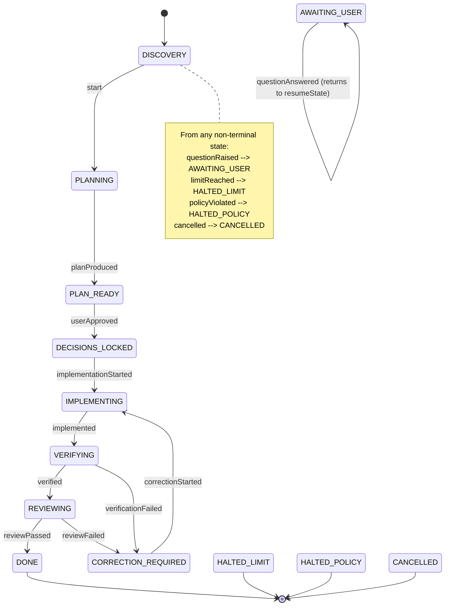

# Domain

The entities Forge owns and the state machine that drives them.

> **Status:** the entities, the event log, and the state machine are built — `#14`
> defines the schemas, `#15` persists them, `#16` adds the event log, `#27` the
> transition table. Still specification: the engine that *drives* the machine (#28–#32)
> and the evidence layer that feeds it (#33–#37). Where a decision is deliberately
> deferred, the issue is named.

## Why Forge owns this at all

An agent's chat transcript is not project state. It is one participant's memory of
a conversation, it drifts between agents, and it cannot be queried, replayed, or
audited. Forge keeps the state; agents read a compiled view of it and report back
(axiom A1).

## Entities

```
Workspace
 └── Project
      ├── Repository     path · defaultBranch · buildCmd · testCmd · tech[]
      ├── Rule           scope · key · value · source
      ├── AgentBinding   role · runtimeId · accountId · permissions
      ├── Decision       statement · rationale · status · lockedAt
      ├── OpenQuestion   asker · evidence[] · options[] · recommendation · answer
      ├── Task           objective · constraints[] · completionCriteria[]
      ├── Workflow       templateId · state · iteration · checkpoint
      │    └── Step      role · agentId · contextRef · output · verdict
      ├── ChangeSet      baseSha · files[] · patch · authorAgent · reviewVerdict
      └── Event          seq · ts · type · payload · actor
```

### The distinctions that matter

**Decision vs Rule.** A rule is standing policy ("never modify migrations"). A
decision is a specific choice made once ("use Redis for the backplane"). Rules are
inherited by scope; decisions are locked and versioned.

**Task vs Workflow.** A task is *what* to achieve, with the criteria that prove it
achieved. A workflow is *how* it is being attempted right now — the state machine
instance, including which iteration it is on.

**ChangeSet vs Step output.** A step's output is what an agent *said*. A changeset
is what the repository *shows*. They are reconciled, not conflated (axiom A3).

**Account vs Agent vs Session.** An account is an authentication identity, an
agent is a logical worker bound to a role, and a session is one runtime
conversation. Switching accounts must change only the credential — never project,
task, decision, workflow, or history state (#44).

## Workflow state machine

```
                    DISCOVERY
                        │
                    PLANNING
                        │
                    PLAN_READY ──(user approves)──> DECISIONS_LOCKED
                                                          │
                                                    IMPLEMENTING ◄─────┐
                                                          │            │
                                                     VERIFYING         │
                                            build · test · diff scope   │
                                                          │            │
                                                     REVIEWING         │
                                                          │            │
                                                ┌─────────┴─────────┐  │
                                              PASS               FAIL  │
                                                │                  │   │
                                              DONE    CORRECTION_REQUIRED
                                                                   │   │
                                                                   └───┘
                                                            iteration++

any state ──(agent uncertain)──> AWAITING_USER ──(answered)──> prior state
any state ──(cap reached)──────> HALTED_LIMIT
any state ──(policy violated)──> HALTED_POLICY
any state ──(user cancels)─────> CANCELLED
```

Terminal: `DONE` · `HALTED_LIMIT` · `HALTED_POLICY` · `CANCELLED`.

`AWAITING_USER` records the state to return to, so resuming is exact rather than
approximate.

### The machine as built

The ASCII diagram above is the specification, kept because it reads well. The diagram below
is **generated from the transition table** in `src/shared/domain/transitions.ts`, so it
cannot drift from the code — `npm run check` fails if it is stale.

<!-- BEGIN GENERATED STATE DIAGRAM -->

<!-- Generated from src/shared/domain/transitions.ts by npm run docs:diagram. Do not edit. -->


<!-- END GENERATED STATE DIAGRAM -->

Triggers are named for the *cause* rather than the destination, because several can lead to
the same state and the reason is what the event log records. `verificationFailed` and
`reviewFailed` both reach `CORRECTION_REQUIRED`; conflating them would lose whether the
build broke or a reviewer objected.

The iteration cap is enforced on the `correctionStarted` edge, because correction is the
only edge that can loop (A5). Crossing it produces `HALTED_LIMIT` with `limitReached` as the
recorded trigger, so the log says "limit" rather than showing a workflow that mysteriously
stopped.

### Rules the machine must hold

```
transitions are DATA, not scattered conditionals   → one table (#27)
an illegal transition throws                        → never silently ignored
the event is written BEFORE the side effect         → write-ahead, so a crash
                                                      cannot lose what happened
every loop is bounded                               → iteration cap, wall-clock,
                                                      idle timeout, no-progress (#29)
```

The no-progress guard exists because a capped loop is not enough: two agents can
exchange identical diffs until the cap, burning time and quota. If consecutive
iterations produce the same diff, the workflow halts.

## Event log

Every domain mutation is an appended event. Read models are projections.

```
command ──> validate ──> append Event(seq, type, payload, actor) ──> project
                              │
                    append-only · never updated · never deleted
```

`actor` is always one of `user`, `agent:<id>`, or `system`. This is what makes
"why is the code like this?" answerable months later, and what makes an agent's
claim checkable against what actually happened.

Read models must be rebuildable from events alone — asserted by a test that drops
and replays them (#16).

## Permissions by role

Enforced by Forge, not requested in a prompt (axiom A7).

```
role              repo read   file write   terminal      git write
planner               ✓            ✗           ✗             ✗
implementer           ✓            ✓           ✓             ✗
reviewer              ✓            ✗       tests only        ✗
```

Git write operations stay off for the MVP: the final commit is the user's call.

## Completion criteria

A task carries machine-checkable criteria, so "done" is evaluated rather than
narrated.

```
✓ build succeeds              evidence: exit code
✓ tests pass                  evidence: runner output
✓ no unrelated files modified  evidence: diff scope check
✓ no assumptions declared      evidence: report.assumptions == []
✗ reviewer verdict PASS        evidence: review report
─────────────────────────────────────────────────────────────
verdict: FAIL → CORRECTION_REQUIRED
```

`unknown` never counts as `pass` (axiom A2). A criterion that cannot be measured
blocks completion instead of being waved through.

## Open questions

The escalation ladder is the mechanism behind "never guess":

```
1. inspect the repository
2. inspect configuration
3. inspect related implementation
4. inspect project state, decisions, prior tasks
        │
   still ambiguous
        │
5. OPEN QUESTION ──> queue ──> workflow pauses ──> user answers ──> resume
```

A question submitted without `evidenceInspected` is rejected back to the agent:
probe first, then ask. An answer may be promoted into a locked `Decision`, so the
same question is never asked twice.

## Agent protocol

Agents exchange structured reports, not prose — this is what removes the human
from the message bus.

```
out  PromptPacket   objective · constraints · lockedDecisions · relevantFiles
                    previousAttempt · reviewFindings · completionCriteria

in   AgentReport    status: completed | blocked | question
                    summary · filesChanged · commandsRun · testsRun
                    openQuestions[] · assumptions[]
```

`assumptions` being non-empty is a policy signal, never a success. `filesChanged`
is a **claim**, reconciled against the real diff (#34).
