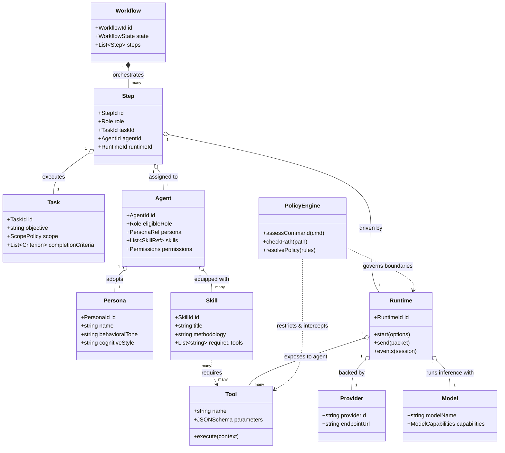
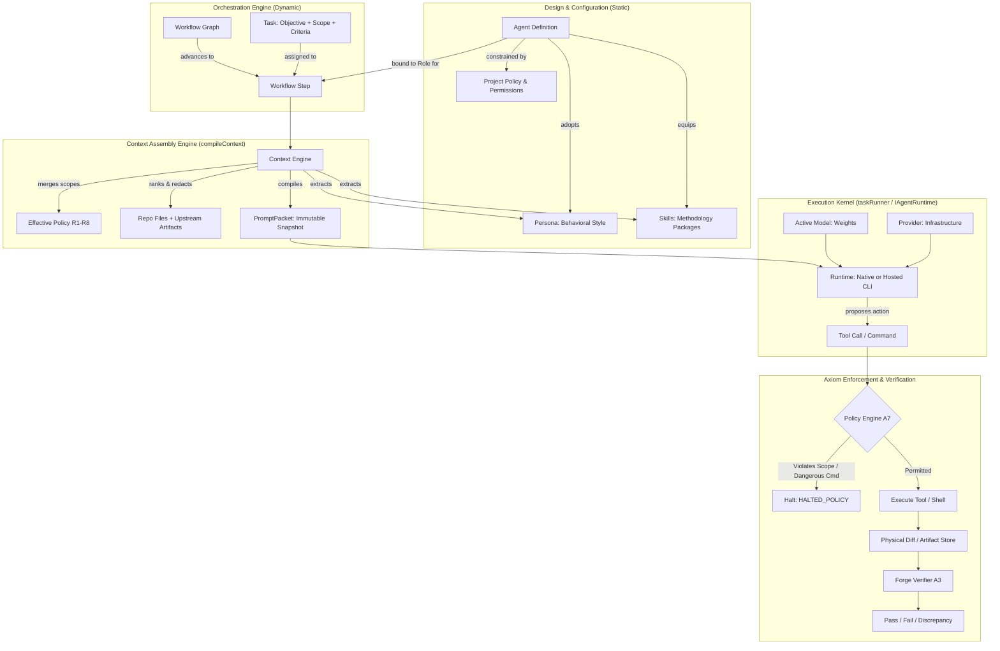

# Forge Architectural Concept Model: Agent, Persona, Skill, Tool, and Runtime

**Status:** PROPOSED  
**Authority:** Architectural Concept Gate & Design Specification  
**Date:** 2026-09-24  
**Baseline:** `main` @ `1dfb444` (PR #203 merged)  
**Related Architecture:** [agent-runtime.md](agent-runtime.md), [domain-model.md](domain-model.md), [execution-model.md](execution-model.md), [workflow-engine.md](workflow-engine.md), [security-and-trust.md](security-and-trust.md)  
**Related Decisions:** [ADR-001](../decisions/ADR-001-agents-runtimes-accounts.md), [ADR-002](../decisions/ADR-002-interactive-orchestration.md), [ADR-003](../decisions/ADR-003-host-the-real-cli.md)  
**Related Contracts:** [execution-protocol.md](contracts/execution-protocol.md), [run-and-step-lifecycle.md](contracts/run-and-step-lifecycle.md)  

---

## 1. Problem & Context

### 1.1 The Multi-Agent Concept Collapse

Multi-agent developer tools consistently fail due to **concept collapse** — the conflation of distinct architectural concerns into a single overloaded term. In naive systems:
- An "agent" is called a "prompt".
- A "runtime" is called an "agent".
- A "tool" is called a "skill".
- A "model" is called a "provider".
- A "persona" is conflated with an agent's security permissions.

When these concepts are conflated, the system degrades rapidly:
1. **Security boundaries become leaky**: Relying on persona prompts ("You are a safe, read-only auditor") instead of physical OS/filesystem policy enforcement violates Axiom A7 (Least Privilege).
2. **Context bloat**: Dumping full tool catalogs, behavioral system prompts, and entire skill manuals into every turn destroys token budgets and increases model confusion.
3. **Execution rigidity**: Tying an agent's logical identity to a specific CLI process or model prevents multi-tier execution (e.g., prototyping locally on Ollama and auditing via Claude Code).
4. **Non-deterministic orchestration**: Allowing steps to dynamically mutate their own agent identity mid-execution destroys event-log reproducibility and breaks Axiom A1 (Forge owns ground truth).

### 1.2 The Forge Architectural Gate

Before expanding Forge's DAG workflow engine (Milestone M6) and interactive human steering controls (Milestone M7), Forge must formalize the canonical boundaries between ten fundamental concepts:
- **Agent**
- **Persona**
- **Skill**
- **Tool**
- **Runtime**
- **Provider**
- **Model**
- **Workflow**
- **Step**
- **Task**

This document establishes the normative meaning, explicit boundaries, relationships, lifecycles, and interaction semantics of these concepts.

---

## 2. Existing Concepts Discovered in the Repository

An inspection of the Forge repository reveals that several concepts already exist in partial, explicit, or implicit forms:

| Existing Concept | Repository Location | Current Implementation / Evidence | Conflation or Limitation Observed |
| :--- | :--- | :--- | :--- |
| **Role** | `src/shared/domain/enums.ts`<br>`roleSchema` (lines 65–73) | Closed enum: `'planner'`, `'implementer'`, `'reviewer'`, `'tester'`, `'security-reviewer'`, `'system'`, `'user'`. | Roles are structural workflow slots. `system` and `user` are performed by Forge or humans, never runtimes. |
| **Capability** | `src/shared/domain/enums.ts`<br>`capabilitySchema` (lines 77–84) | Enum: `'repo-read'`, `'file-write'`, `'terminal'`, `'plan'`, `'review'`, `'test'`. Checked against `ROLE_REQUIRED_CAPABILITIES`. | Coarse capabilities; declares what a runtime can do, not fine-grained tool exposure. |
| **Runtime Interface** | `src/shared/domain/runtime.ts`<br>`IAgentRuntime` (lines 374–430) | `start()`, `send()`, `events()`, `status()`, `cancel()`, `dispose()`. Pure execution interface (Axiom A6). | Interface is called `IAgentRuntime`, inadvertently conflating the execution engine with the "agent" concept. |
| **Agent Binding** | `src/shared/domain/project.ts`<br>`agentBindingSchema` (lines 83–93) | Per-project mapping: `role` + `runtimeId` + `accountId` + `capabilities` + `permissions`. | Pairs a Role directly to a Runtime, bypassing any first-class Agent or Persona entity. |
| **Persona** | `ADR-001` (lines 58–65)<br>`AskPage.tsx`<br>`WorkflowNode.tsx` | Informally used as display names ("Alex (Planner)", "Sam (Implementer)") and prompt framing ("You are an AI Assistant..."). | Persona is treated merely as UI cosmetics or a static string in `AskPage.tsx`, lacking domain modeling. |
| **Skill** | `cliSkillInjector.ts`<br>`workflowGraph.ts`<br>`defaultTemplatesV2.ts` | Stored as string arrays (`skills: ['ast-editing', 'code-review']`). Injected into `.forge/skills` as markdown bullet points. | Skills are currently unvalidated text tags. There is no packaging schema, dependency declaration, or verification. |
| **Tool** | `src/main/providers/tools.ts`<br>`TOOL_DEFINITIONS` (lines 45–143) | Concrete functions: `read_file`, `list_dir`, `search_files`, `write_file`, `edit_file`, `run_command`. | External CLI agents bring vendor tools; native agent uses Forge's tools. Tools lack modular extension. |
| **Provider** | `src/main/providers/activeModel.ts`<br>`chatStream.ts`, `ADR-001` | External services/vendors: `ollama`, `openai`, `openrouter`, `anthropic`, or CLI executables (`claude`, `agy`). | Often conflated with Model in UI selection. |
| **Model** | `src/main/providers/activeModel.ts`<br>`capabilities.ts` | Concrete model IDs (`qwen2.5-coder:7b`, `claude-3-7-sonnet`). Probed for `tools`, `vision`, `thinking`. | Separate from Provider in logic, but stored in a flat JSON file (`ActiveModelStore`). |
| **Policy & Permissions** | `src/shared/domain/policyEngine.ts`<br>`rolePermission.ts`, `policy.ts` | `DANGEROUS_COMMANDS`, `assessCommandPolicy`, `resolveEffectivePolicy`, `RULE_SCOPES` (6 tiers). | Strongly separated from prompts. Prompts suggest; policy blocks. |
| **Task** | `src/shared/domain/task.ts`<br>`taskSchema` | Explicit domain object: `objective`, `constraints`, `completionCriteria`, `scope` (`allowedPaths`, `forbiddenPaths`). | Clean, decoupled unit of work. |
| **Workflow & Step** | `workflow.ts`, `template.ts`<br>`workflowGraph.ts`, `run.ts` | `WorkflowTemplate`, `WorkflowStep`, `workflowStateSchema` (11 states), `runStatusSchema` (4 states). | Robust state machines on `main`. |

---

## 3. Canonical Terminology & 20 Architectural Distinctions

### 3.1 The Ten Canonical Concepts

1. **Agent**: The logical worker identity and capability configuration. An Agent defines *who* performs work. It binds an eligible **Role**, adopts a **Persona**, equips a set of **Skills**, and holds base **Permissions** and policy constraints.
2. **Persona**: The behavioral, stylistic, and cognitive profile. A Persona defines *how the worker behaves* (communication tone, skepticism, architectural conservatism, concise vs explanatory output).
3. **Skill**: A modular, reusable capability and methodology package. A Skill defines *what methodology the worker is equipped with* (domain-specific instructions, heuristic checklists, design patterns, and declarations of required Tools). A Skill is declarative and instructive; it is **not** an executable binary.
4. **Tool**: An executable operation exposed to an execution engine. A Tool defines *what operation the worker can execute* (e.g. `read_file`, `write_file`, `edit_file`, `run_command`, AST transforms). Tools cause side effects or read physical environment state.
5. **Runtime**: An execution mechanism implementing `IAgentRuntime`. A Runtime defines *how execution is performed* (spawning child processes, managing pseudo-terminals / PTYs, driving native tool loops, and streaming events).
6. **Provider**: The external vendor, platform, or host implementation behind a runtime adapter (`anthropic`, `ollama`, `openai`, `google`, or installed CLI executables).
7. **Model**: The concrete machine learning inference weights (e.g. `claude-3-7-sonnet`, `qwen2.5-coder:7b`) that perform token prediction and reasoning during an agent turn.
8. **Workflow**: The orchestration graph and state machine (DAG or linear sequence) governing execution stages, human approval gates, automated verification, and bounded retry loops.
9. **Step**: A single atomic execution node within a Workflow instance, representing one turn or stage of work assigned to an Agent or Forge subsystem.
10. **Task**: The declarative unit of objective work assigned to a run or step, specifying the goal, constraints, allowed file scopes, and objective completion criteria.

---

### 3.2 The 20 Architectural Questions Answered

```text
┌────────────────────────────────────────────────────────────────────────────────────────┐
│                        THE 20 ARCHITECTURAL DISTINCTIONS                               │
├────────────────────────────────────────────────────────────────────────────────────────┤
│  1. Multiple Agents use same Runtime?        YES                                       │
│  2. One Agent use different Runtimes?        YES                                       │
│  3. One Agent have multiple Skills?          YES                                       │
│  4. Multiple Agents share a Skill?           YES                                       │
│  5. Persona part of Agent or independent?    REUSABLE INDEPENDENT OBJECT               │
│  6. Skills executable or instruction pkgs?   INSTRUCTION & METHODOLOGY PACKAGES        │
│  7. Tools independent from Skills?           YES (Tools = Execution, Skills = Method)  │
│  8. Skill require specific Tools?            YES (Declared Prerequisite)               │
│  9. Policy restrict Tools independently?     YES (Axiom A7: Policy > Skill)            │
│ 10. Role different from Agent?               YES (Role = Workflow Slot, Agent = Worker)│
│ 11. Runtime change while preserving Agent?   YES                                       │
│ 12. Model part of Runtime or Agent?          RUNTIME EXECUTION CONFIGURATION           │
│ 13. Claude & Ollama run same Agent def?      YES (Subject to capability check)         │
│ 14. Forge persist Agent definitions?         YES (Project/Workspace Config)           │
│ 15. Forge persist Skill definitions?         YES (Versioned Skill Packages)            │
│ 16. Skills user, system, or both?            BOTH                                      │
│ 17. Workflow choose Agent dynamically?       YES (Via Router Node / Pre-Execution)     │
│ 18. Step choose Agent dynamically?           NO (Immutable during Step execution)      │
│ 19. Agent switch Skills during a run?        NO mid-step; YES across Workflow steps    │
│ 20. Assembly layer vs Agent definition?      AGENT = Identity; ASSEMBLY = Turn Context │
└────────────────────────────────────────────────────────────────────────────────────────┘
```

#### Detailed Answers & Architectural Rationale:

1. **Can multiple Agents use the same Runtime?**  
   **YES.** A Runtime (`IAgentRuntime`) is an execution engine (e.g., `NativeAgentRuntime` or `HostedClaudeRuntime`). "Alex the Architect" (Planner) and "Sam the Implementer" can both execute through the same Native Runtime instance.
2. **Can one Agent use different Runtimes?**  
   **YES.** An Agent is a logical worker specification. An agent definition ("Alex the Planner") can run on `NativeAgentRuntime` with Ollama on a developer laptop, or on `HostedClaudeRuntime` in a cloud container, provided the runtime satisfies the role's required capabilities.
3. **Can one Agent have multiple Skills?**  
   **YES.** An agent can be equipped with multiple complementary methodology packages (e.g., an Implementer agent equipped with `typescript-refactoring` and `sql-migration-safety`).
4. **Can multiple Agents share a Skill?**  
   **YES.** Skills are reusable packages. The `security-audit` skill can be equipped by both a Reviewer agent (for post-implementation review) and an Implementer agent (for pre-submission self-checking).
5. **Is Persona part of Agent identity or a reusable independent object?**  
   **Reusable independent object referenced by Agent identity.** A Persona defines behavioral posture (e.g., "Skeptical Auditor", "Pragmatic Prototyper"). Multiple agents across different projects can reference the same Persona.
6. **Are Skills executable capabilities or instruction/context packages?**  
   **Instruction and methodology packages.** In Forge, Skills do **not** compile into binary plugins or executable code. They are structured packages containing operational guidelines, heuristic checklists, few-shot patterns, and declarations of tool requirements. Tools provide execution; Skills provide domain knowledge and method.
7. **Are Tools capabilities independent from Skills?**  
   **YES.** Tools (`read_file`, `run_command`, AST transforms) are primitives provided by the runtime environment or host OS. They exist regardless of whether any Skill is loaded.
8. **Can a Skill require specific Tools?**  
   **YES.** A Skill can declare required tool signatures (e.g., an `ast-refactoring` skill requires an AST editing tool or `edit_file`; a `test-driven-development` skill requires a test runner tool). If the runtime or policy does not provide the required tool, the skill cannot be activated.
9. **Can Policy restrict Tools independently of Skill?**  
   **YES (Axiom A7).** Policy is a hard, non-negotiable boundary enforced by Forge (`policyEngine.ts`). Even if a Skill instructs the agent to execute `git push --force` or touch files outside `allowedPaths`, Forge's policy engine intercepts and blocks the call or halts the run with `HALTED_POLICY`. Prompts and skills are suggestions; policy is law.
10. **Is a Role different from an Agent?**  
    **YES.** A Role (`roleSchema`) is an abstract functional slot in a workflow pipeline (`planner`, `implementer`, `reviewer`). An Agent is a concrete logical worker definition that can be *bound* to hold a Role for a project, workflow, or step.
11. **Can Runtime change while preserving Agent identity?**  
    **YES.** An agent's identity, persona, skills, and constraints remain intact even if the runtime backend is swapped (e.g., switching from Claude CLI to native Ollama due to quota limits).
12. **Is Model part of Runtime configuration or Agent identity?**  
    **Runtime configuration.** An Agent identity defines *who* the worker is and *what* they know. The Model (`claude-3-7-sonnet`, `qwen2.5-coder:7b`) is an execution parameter chosen at runtime. However, an Agent or Skill may declare minimum model requirements (e.g., requiring tool-calling or reasoning capabilities via `capabilities.ts`).
13. **Can Claude and Ollama execute the same Agent definition?**  
    **YES.** Because Forge's Context Engine compiles the prompt packet into a standardized, provider-neutral shape, any runtime capable of holding the role can execute the turn.
14. **Does Forge persist Agent definitions?**  
    **YES.** Agent configurations are persisted at the Project or Workspace level, distinct from ephemeral execution runs. In SQLite/event logs, the exact snapshot of the agent configuration used for each step is permanently recorded.
15. **Does Forge persist Skill definitions?**  
    **YES.** Skill definitions are persisted as versioned, declarative packages (e.g., in `.forge/skills/` or a workspace registry) so that workflow runs are reproducible.
16. **Are Skills user-created, system-defined, or both?**  
    **BOTH.** Forge provides built-in system skills (e.g., `forge-protocol-reporting`, `repo-inspection`, `diff-verification`), while users and teams can author custom project skills.
17. **Can a Workflow choose an Agent dynamically?**  
    **YES, via workflow routing nodes.** A router node or workflow condition may select which Agent to assign to an upcoming Step based on task classification. However, the selection occurs *before* step execution begins.
18. **Can a Step choose an Agent dynamically?**  
    **NO.** A Step is an atomic execution unit. Its assigned Agent, Role, and Runtime are locked upon step initialization. An active step cannot mutate its own agent identity mid-flight; doing so would violate event-log immutability (Axiom A1).
19. **Can an Agent switch Skills during a run?**  
    **NO mid-step; YES across workflow steps.** Within an atomic step turn, the active skills are frozen in the snapshotted `PromptPacket`. Between steps, a workflow may activate different skills based on the evolving phase.
20. **What belongs in the prompt/context assembly layer versus the Agent definition itself?**  
    - **Agent Definition (Static / Config)**: Identity, Role eligibility, Persona reference, Equipped skills list, Base permissions, Default constraints.
    - **Context Engine (Dynamic / Assembly)**: Task objective, Allowed file scopes, Relevant repository files ranked by budget, Merged effective policy (Global → Task), Verbatim locked decisions, Previous attempt diffs and review findings, Upstream step artifacts, and Rendered skill instructions.

---

## 4. Concept Relationship Diagram

### 4.1 Structural Composition Model



### 4.2 Runtime Invocation & Context Assembly Flow



---

## 5. Responsibility of Each Concept

| Concept | Primary Responsibility | Input It Receives | Output It Produces |
| :--- | :--- | :--- | :--- |
| **Agent** | Represents the complete logical worker definition and authority envelope. | Project role requirements, user preferences. | Identity configuration, capability bindings, permission limits. |
| **Persona** | Defines behavioral tone, cognitive orientation, and communication style. | Base prompt templates. | Behavioral framing block for system prompt. |
| **Skill** | Provides domain-specific methodology, operational checklists, and design patterns. | Task domain requirements. | Structured methodology instructions for Context Engine; tool prerequisites. |
| **Tool** | Executes concrete operations (filesystem, shell commands, AST transformations). | Invocation arguments from model. | `ToolResult` (`ok`, `content`, exit code, output). |
| **Runtime** | Manages OS process boundaries, PTYs, event streaming, and transport protocol. | `SessionOptions`, `PromptPacket`. | `RuntimeEvent` stream (`chunk`, `tool`, `state`, `result`, `error`). |
| **Provider** | Hosts external inference or supplies executable CLI adapters. | Network requests / Process spawn. | LLM tokens, raw stdout/stderr streams. |
| **Model** | Performs neural inference, reasoning, and token generation. | Context tokens (prompt packet). | Generated tokens, proposed tool calls, reasoning traces. |
| **Workflow** | Manages stage transitions, dependency edges, gates, and bounded loops. | Step verdicts, user approvals. | Workflow state transitions, next step activation. |
| **Step** | Orchestrates a single atomic unit of execution in a workflow. | Task definition, assigned Agent, bound Runtime. | `StepEvidence`, `ChangeSet`, step verdict. |
| **Task** | Defines the objective goal, scope constraints, and completion criteria. | User intent / upstream step output. | Machine-verifiable contract of work. |

---

## 6. Explicit Non-Responsibilities

To maintain clean architectural boundaries, each concept has strict negative constraints:

- **Agent MUST NOT**:
  - Spawn processes or manage PTYs (owned strictly by `Runtime`).
  - Bypass or relax project permissions (owned strictly by `PolicyEngine`).
  - Decide whether its own work is complete (owned strictly by `Verifier` under Axiom A3).
- **Persona MUST NOT**:
  - Grant or withhold permissions (a "polite" persona has no more permissions than an "adversarial" persona).
  - Define executable tools or file scopes.
  - Dictate workflow state machine transitions.
- **Skill MUST NOT**:
  - Contain or execute binary application code directly (it specifies methodology; `Tools` execute).
  - Overwrite or bypass global safety rules R1–R8.
  - Directly mutate git repositories or SQLite stores.
- **Tool MUST NOT**:
  - Make policy decisions or self-authorize actions (must defer to `PolicyEngine`).
  - Assemble its own prompt context.
  - Declare a workflow step completed.
- **Runtime MUST NOT**:
  - Name external providers in core interfaces (enforcing Axiom A6).
  - Compile or synthesize prompt packets (owned strictly by `ContextEngine`).
  - Evaluate completion criteria or verify git diffs (owned strictly by `Verifier`).
- **Provider MUST NOT**:
  - Be referenced directly outside adapter boundaries in `src/main/runtimes/` or `src/main/providers/`.
  - Store unencrypted credentials in SQLite or event logs.
- **Model MUST NOT**:
  - Be trusted to report its own physical changes honestly (Axiom A3).
  - Dictate safety policies.
- **Workflow MUST NOT**:
  - Modify repository code directly (it sequences steps; steps and engines modify code).
  - Allow infinite loops without bound (Axiom A5).
- **Step MUST NOT**:
  - Mutate its assigned Agent or Runtime mid-flight.
  - Conceal physical discrepancies or uncommitted changes.
- **Task MUST NOT**:
  - Encode specific runtime provider names (e.g. "Use Claude for this").
  - Omit completion criteria (a task without criteria is an invalid opinion under Axiom A3).

---

## 7. Concept Lifecycle

```text
┌──────────────┐     ┌──────────────┐     ┌──────────────┐     ┌──────────────┐
│ DEFINITION   │ ──> │ BINDING      │ ──> │ ACTIVATION   │ ──> │ EXECUTION    │ ──> TERMINATION
│ (Design/Repo)│     │ (Project/Wf) │     │ (Step Start) │     │ (Turn Loop)  │     (Verify/Halt)
└──────────────┘     └──────────────┘     └──────────────┘     └──────────────┘
```

1. **Definition Phase (Static / Design-Time)**:
   - Personas and Skills are authored as declarative files (`.forge/skills/`, templates).
   - Agents are configured by selecting a Persona, equipping Skills, and defining permission ceilings.
   - Workflows are defined as linear templates or DAG graphs.
2. **Binding Phase (Project / Workflow Configuration)**:
   - For a given Project, Roles are bound to eligible Agents.
   - Runtime adapters are registered and models configured in `ActiveModelStore`.
3. **Activation Phase (Step Start)**:
   - Workflow activates a Step and assigns a Task.
   - `ContextEngine` compiles the `PromptPacket`, merging the Agent's Persona, equipped Skills, project rules, and scoped files into a deterministic snapshot.
   - `Runtime.start()` initializes the session (PTY or in-process loop).
4. **Execution Phase (Turn Loop)**:
   - `Runtime.send()` transmits the packet.
   - Model generates tool calls; `PolicyEngine` intercepts and verifies every call against permissions and `allowedPaths`.
   - Permitted tools execute; results stream back via `RuntimeEvent`.
5. **Termination Phase (Step Finish & Verification)**:
   - Agent outputs final `FORGE_REPORT`.
   - `Runtime.dispose()` releases child processes and file descriptors.
   - `GitService` captures physical diff; `Verifier` evaluates completion criteria and records immutable `StepEvidence` in SQLite and event logs.

---

## 8. Configuration vs. Runtime State

To preserve Axiom A1 (Forge owns ground truth) and ensure deterministic replaying, configuration state is strictly segregated from ephemeral runtime state:

| Concept | Configuration State (Durable, Edit-Time) | Runtime State (Ephemeral, Step-Time) |
| :--- | :--- | :--- |
| **Agent** | Name, Persona reference, Equipped Skill IDs, Base permissions, Role eligibility. | Active session binding, temporary step overrides. |
| **Persona** | Display label, icon, behavioral guidelines, cognitive style description. | Formatted system prompt chunk in `PromptPacket`. |
| **Skill** | Package metadata, methodology markdown, prerequisite tool signatures. | Materialized files in `.forge/skills/`, injected prompt text. |
| **Tool** | JSON Schema definitions, capability tags, executable handlers. | Invocation counters, tool duration, execution return buffers. |
| **Runtime** | Executable path, adapter type, timeout caps, account/credential pointers. | `SessionHandle`, PID, PTY stream descriptors, active event iterators. |
| **Provider** | Endpoint URL, provider type (`ollama`, `openai`, `cli`). | Active HTTP connection pools, rate-limit retry state. |
| **Model** | Model ID, context window limit, detected capabilities (`tools`, `thinking`). | Tokens spent, input/output cost, current turn context window. |
| **Workflow** | Template definition, DAG nodes, edges, checkpointing limits. | Current node pointer, iteration count, checkpoint snapshot. |
| **Step** | Step index, role requirement, declared inputs/outputs. | `stepId`, `startedAt`, raw output text, claimed vs physical diff. |
| **Task** | Objective string, allowed path globs, completion criteria formulas. | Measured criteria results, discrepancies observed. |

---

## 9. Persistence Implications

The introduction of this formal concept model dictates clear persistence boundaries across Forge's dual-tier storage architecture:

### 9.1 Where Each Concept Lives

1. **Filesystem (`.forge/` in Workspace)**:
   - **Skills**: Stored under `.forge/skills/<skill-name>/` (e.g. `SKILL.md`, reference patterns). Version-controlled alongside project code.
   - **Repository Instructions**: `AGENTS.md`, `FORGE.md`, `.forge/instructions.md`.
   - **Artifacts**: Large binary outputs, diff patches, and raw session transcripts under `.forge/artifacts/<runId>/`.
2. **Project Database (`SQLite`)**:
   - **Agent Configurations**: Stored in a project configuration table (or serialized JSON settings) linking roles, personas, skills, and permissions.
   - **Workflow & Step Records**: Stored in `runs` and `run_steps` tables (`runStatusSchema`: `running`, `completed`, `failed`, `halted`).
   - **Criteria & Evidence**: Stored in `step_evidence` and `criteria_results`.
3. **Immutable Event Log (`EventStore`)**:
   - Every Step start, Agent assignment, PromptPacket snapshot, Tool invocation, and Policy decision is appended to the event log (`run_events`).
   - Replaying an event log reconstructs the exact state without needing live external runtimes.

---

## 10. Workflow Interaction

Workflows interact with Agents strictly through **Roles** and **Steps**:

```text
Workflow Template (names Roles)
        │
        ▼
   Project Binding (maps Role -> Agent)
        │
        ▼
   Step Instantiation (assigns Task + Agent -> Runtime)
        │
        ▼
   Execution & Objective Verification
```

1. **Role-Based Decoupling**: Workflow templates name **Roles** (`planner`, `implementer`, `reviewer`), never specific Agents or Runtimes.
2. **Deterministic Binding**: When a workflow initializes, each step's Role resolves to the project's configured Agent.
3. **Router Nodes**: In DAG workflows (Milestone M6), a `router` node may inspect upstream artifacts and select an appropriate Agent for downstream steps based on domain tags (e.g., selecting an "SQL Migration Agent" vs a "Frontend Agent"). Once the step starts, the binding is fixed.

---

## 11. Tool Interaction

### 11.1 Native Tools vs. CLI Vendor Tools

Forge operates under a dual tool execution reality:
1. **Hosted Native Agent (`NativeAgentRuntime`)**:
   - Forge hosts the tool loop directly (`agentLoop.ts`).
   - Tools are defined via `TOOL_DEFINITIONS` (`src/main/providers/tools.ts`).
   - The model emits structured function calls; Forge validates and executes them locally, subject to `ToolContext` checks.
2. **External CLI Agents (`HostedClaudeRuntime`, `AntigravityCliRuntime`)**:
   - The external CLI manages its own internal tool implementations (e.g. Claude Code's native bash/edit commands).
   - Forge wraps the CLI in a pseudo-terminal (PTY) and installs local project hooks (ADR-003).
   - Forge governs execution via command policy (`assessCommandPolicy`), `--permission-mode`, and worktree sandbox reconciliation.

### 11.2 Tool Discovery & Skill Requirements

- Tools are registered in a system tool registry.
- When an Agent is equipped with a Skill that requires `ast-editing`, Forge checks if an AST editing tool is registered and permitted. If not, the Skill is marked degraded or inactive.

---

## 12. Policy Interaction

The Policy Engine (`src/shared/domain/policyEngine.ts`) enforces Axiom A7 (Least Privilege) across all concepts:

```text
                  Agent / Skill / Model Prompt
                               │
                      [ Proposed Action ]
                               │
                               ▼
                    ┌─────────────────────┐
                    │    POLICY ENGINE    │
                    │   (Non-Negotiable)  │
                    └──────────┬──────────┘
                               │
         ┌─────────────────────┼─────────────────────┐
         ▼                     ▼                     ▼
 Dangerous Commands      Allowed Paths        Role Permissions
   (DANGEROUS_CMDS)     (Task Scope Globs)   (Binding Permissions)
         │                     │                     │
      BLOCK /               BLOCK /               BLOCK /
   HALTED_POLICY         HALTED_POLICY         HALTED_POLICY
```

- **Policy Trumps Prompts & Skills**: A Skill instruction saying "Run `git reset --hard` to clean up" is unconditionally blocked by `DANGEROUS_COMMANDS`.
- **Policy Trumps Persona**: An agent with an aggressive or autonomous persona still cannot modify files outside `allowedPaths`.
- **Hierarchical Rules**: Rules resolve via `resolveEffectivePolicy` across the 6 scopes (`global` → `workspace` → `project` → `workflow` → `agent` → `task`). The narrower scope wins, but cannot override global safety prohibitions.

---

## 13. Prompt & Context Assembly Boundary

The `ContextEngine` (`src/shared/domain/contextEngine.ts`) compiles the input context. It is critical to enforce the boundary between what comes from the **Agent definition** versus what is assembled for the **Turn Context**:

```text
┌────────────────────────────────────────────────────────────────────────┐
│                        PROMPT PACKET BOUNDARY                          │
├────────────────────────────────────────────────────────────────────────┤
│  AGENT DEFINITION (Static)                                             │
│  ├── Role: Framing & system boundaries ('planner', 'implementer', etc.)│
│  ├── Persona: Tone, skepticism, style guidelines                       │
│  ├── Equipped Skills: Rendered methodology & domain patterns           │
│  └── Permissions: Base capabilities & denied operations                │
├────────────────────────────────────────────────────────────────────────┤
│  TURN CONTEXT (Dynamic / Ephemeral)                                    │
│  ├── Task: Objective, constraints, and completion criteria             │
│  ├── Effective Policy: Merged rules from all 6 scopes                  │
│  ├── Locked Decisions: Verbatim architectural decisions (Axiom A4)     │
│  ├── Scope: allowedPaths and forbiddenPaths globs                      │
│  ├── Relevant Files: Ranked by import distance & budget                │
│  ├── Previous Attempt: Physical git diffStat & review findings         │
│  ├── Upstream Artifacts: Deliverables from prior workflow steps        │
│  └── Repo Instructions: CLAUDE.md / AGENTS.md                          │
└────────────────────────────────────────────────────────────────────────┘
```

The compiled `PromptPacket` is hashed, snapshotted in SQLite, and saved to the artifact store, ensuring full determinism and replayability.

---

## 14. Concrete End-to-End Examples

### Scenario A: Full-Stack Feature Implementation (Native Agent + Ollama)
- **Workflow**: `Feature Implementation` linear pipeline.
- **Step 1 (Planning)**:
  - Role: `planner`
  - Agent: `Alex` (Persona: "Skeptical Architect", Skills: `system-architecture`, `api-design`)
  - Runtime: `forge-native-agent` (Model: `qwen2.5-coder:7b` via Ollama)
  - Output: Architecture plan artifact + locked decisions.
- **Step 2 (Implementation)**:
  - Role: `implementer`
  - Agent: `Sam` (Persona: "Careful Coder", Skills: `ts-refactoring`, `unit-testing`)
  - Runtime: `forge-native-agent` (Model: `qwen2.5-coder:7b`)
  - Tools: `read_file`, `edit_file`, `run_command`
  - Policy: `writeFiles: true`, `gitWrite: false`, `allowedPaths: ['src/api/**', 'tests/**']`
  - Output: Code changes on disk + `FORGE_REPORT`.
- **Step 3 (Verification)**:
  - Role: `system` (Performed by Forge Engine; no Agent/Runtime involved).
  - Verifier runs compiler, tests, diff reconciliation.

### Scenario B: Security Review Turn (Hosted Claude Code CLI)
- **Role**: `security-reviewer`
- **Agent**: `Morgan` (Persona: "Adversarial Auditor", Skills: `owasp-top-10`, `threat-modeling`)
- **Runtime**: `hosted-claude` (spawns `claude` CLI inside ConPTY, ADR-003)
- **Policy**: `writeFiles: false`, `terminal: false`, `permissionMode: 'plan'`
- **Execution**: Claude runs read-only in the temporary worktree; Morgan applies threat modeling heuristics and returns findings between `FORGE_REPORT_BEGIN` and `FORGE_REPORT_END`.

---

## 15. Anti-Patterns to Prevent

1. **Anti-Pattern 1: "The Monolithic Prompt Agent"**  
   *Smell*: Inlining persona, skills, tool declarations, project rules, and file lists into a single giant markdown string.  
   *Consequence*: Context window exhaustion, inability to cache prompt prefixes, untestable policy enforcement.
2. **Anti-Pattern 2: "Runtime Named in Core Logic" (Breaching Axiom A6)**  
   *Smell*: Code in `src/main/core/` checking `if (agent.name === 'claude')`.  
   *Consequence*: Vendor lock-in, regression when CLIs update, broken mock testing. Core must know only `IAgentRuntime`.
3. **Anti-Pattern 3: "Security by Persona Prompt" (Breaching Axiom A7)**  
   *Smell*: Adding `"Please do not run dangerous commands or touch files outside src/"` to the system prompt and disabling OS-level permission checks.  
   *Consequence*: Immediate prompt injection vulnerability and accidental data loss. Policy engine must act as an independent OS-level gate.
4. **Anti-Pattern 4: "Executable Script as Skill"**  
   *Smell*: Treating a Skill as a custom executable JavaScript file executed directly by the server.  
   *Consequence*: Bypasses the LLM tool loop, evades policy engine inspection, and creates arbitrary code execution vulnerabilities. Skills must remain declarative; executable operations belong in Tools.
5. **Anti-Pattern 5: "Dynamic Mid-Step Mutation"**  
   *Smell*: A step dynamically changing its Agent, Role, or Runtime halfway through its execution.  
   *Consequence*: Corrupts step evidence, breaks replayability, and violates event log integrity (Axiom A1).

---

## 16. Open Questions Requiring Human Architectural Decisions

The following architectural questions remain unresolved and require an explicit design decision from the project maintainer:

- **Q-CAM-01: Agent Configuration Storage Format**  
  *Question*: Should Agent definitions be stored as individual declarative YAML/Markdown files in the repository (e.g. `.forge/agents/<agent-id>.md` or `.forge/agents.json`), or as rows in a project-scoped SQLite table?  
  *Trade-off*: Files in `.forge/` are version-controlled and portable with git checkouts; SQLite rows allow relational foreign keys to project bindings and easier UI CRUD.
- **Q-CAM-02: Skill Packaging & Distribution Standard**  
  *Question*: Should Forge standardize its Skill package format around the emerging `SKILL.md` standard (with YAML frontmatter and markdown sections) or create a proprietary JSON/Zod schema?  
  *Trade-off*: `SKILL.md` allows seamless interoperability with tools like Antigravity, Claude Code, and Noto; a Zod schema enables compile-time type verification.
- **Q-CAM-03: Exposing Forge Tools to External CLI Agents**  
  *Question*: How should Forge expose custom tools (beyond native CLI tools) to hosted CLI runtimes (ADR-003)? Via an ephemeral local MCP server, or by synthesizing CLI-specific configuration files?  
  *Trade-off*: Local MCP is standard across modern CLIs (`claude`, `opencode`), but requires background daemon management; file synthesis is simpler but vendor-dependent.
- **Q-CAM-04: Model-to-Role Compatibility Matrix**  
  *Question*: Should Forge prevent users from binding weak models (e.g., models lacking tool support or reasoning capabilities detected by `capabilities.ts`) to complex roles like `implementer`?  
  *Trade-off*: Hard validation prevents failed runs; soft warnings allow experimental local model testing.

---

## 17. Rejected Alternatives

### Rejected Alternative 1: Conflating Agent and Runtime ("Claude is an Agent")
- **Proposal**: Model `Claude`, `Antigravity`, and `Ollama` as Agents directly.
- **Why Rejected**: Violates Axiom A6. Claude is a tool-using CLI / runtime, not a task-specific agent. Tying an agent's identity to a specific binary prevents switching to a local model when offline or sharing personas across different backends.

### Rejected Alternative 2: Treating Skills as Executable Plugins
- **Proposal**: Implement Skills as TypeScript/Node.js classes with an `execute()` method that runs arbitrary code.
- **Why Rejected**: Turns skills into unmonitored plugins that bypass Forge's tool logging, token tracking, and policy engine. Executable capabilities belong exclusively in **Tools**; Skills must remain declarative methodologies and instruction sets.

### Rejected Alternative 3: Merging Model into Agent Identity
- **Proposal**: Hardcode the model string (e.g. `claude-3-7-sonnet`) directly into the Agent identity schema.
- **Why Rejected**: Prevents reusing the same agent configuration across environments with different resource availability (e.g., running high-end Claude in CI and local Qwen on an air-gapped developer machine). Model is a runtime execution parameter.

### Rejected Alternative 4: Dynamic Agent Selection Inside an Active Step
- **Proposal**: Allow an active step to delegate its execution to a different agent mid-run based on model self-reflection.
- **Why Rejected**: Destroys execution determinism, invalidates write-ahead step records, and prevents verifiable audit trails. Delegation must be handled at the Workflow graph level via Router nodes, not inside an active step.

---

## Architecture Status

**ARCHITECTURE STATUS: PROPOSED / BLOCKED**

This concept model is in the **PROPOSED** state. Implementation is **BLOCKED** pending human architectural decisions on open questions **Q-CAM-01** (Agent storage format), **Q-CAM-02** (Skill packaging standard), and **Q-CAM-03** (Tool exposure mechanism for external CLIs).

No production code, database schemas, managers, or APIs should be implemented until these decisions are formally ratified in an ADR.
