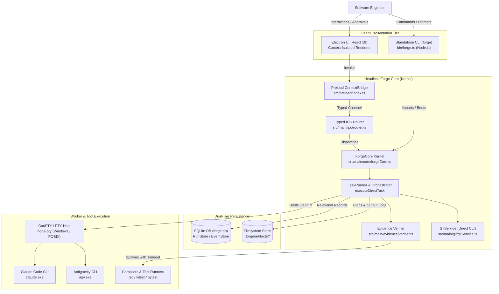

# System Context & Process Boundaries

**Status:** IMPLEMENTED  
**Authority:** Informative Architecture Diagram  
**Last Updated:** 2026-09-25  
**Baseline:** `main` @ `5987501` (PR #204 merged)  
**Related Architecture:** [architecture-overview.md](../architecture-overview.md)  

---

## 1. System Topology & Context

