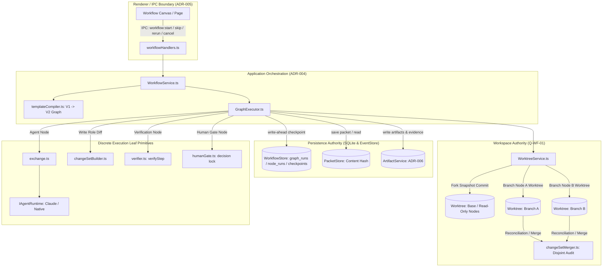

# ADR-007: Generic Workflow Graph Architecture & Execution Model

**Status:** ACCEPTED  
**Date:** 2026-09-29  
**Decision Authority:** Human Architectural Approval (Milestone M6 Gate)  
**Authors:** Google DeepMind / Antigravity Agent  
**Target Milestone:** M6: Generic Workflow Graph Engine (`WORK-001`, `WORK-002`, `WORK-003`)  
**Scope:** Core Domain, Workflow Execution Engine, Persistence Schema, Worktree Concurrency, and Verification Boundaries  
**Related Decisions:** [ADR-001](ADR-001-agents-runtimes-accounts.md), [ADR-002](ADR-002-interactive-orchestration.md), [ADR-003](ADR-003-host-the-real-cli.md), [ADR-004](ADR-004-architectural-layering-and-boundaries.md), [ADR-005](README.md), [ADR-006](ADR-006-artifact-storage-authority.md)  
**Related Specifications:** `docs/architecture/workflow-engine.md`, `docs/DOMAIN.md`, `docs/roadmap/milestones.md`  

---

## 1. Context & Problem Statement

Forge currently executes workflows through a deterministic, sequential 13-state finite state machine (`src/shared/domain/transitions.ts`), driven by linear template definitions (`WorkflowTemplate`, `TemplateStep[]` in `src/shared/domain/template.ts`) and orchestrated by `Orchestrator` (`src/main/runtimes/orchestrator.ts`). This architecture was stabilized under Milestone M4 / M5 (Core Linear Engine & Verification), providing write-ahead state transitions, iteration caps, diff-based progress detection, and independent verification.

However, the sequential pipeline suffers from major architectural limitations:
1. **Rigid Topology:** Steps execute only in a single linear sequence. Real software engineering workflows require arbitrary directed graphs: fan-out parallel branches (e.g. concurrent component implementations or parallel test suites), conditional evaluation, and convergence/fan-in joins.
2. **Prototype Disconnection:** An exploratory DAG prototype exists on `main` across `src/shared/domain/workflowGraph.ts` (defining `WorkflowTemplateV2`, `WorkflowNode`, `WorkflowEdge`, cycle checks) and `src/main/workflows/dagExecutor.ts` (in-memory execution). However, this prototype is completely detached from Forge's production persistence (`WorkflowStore`), runtime abstraction (`IAgentRuntime`), git isolation (`WorktreeService`), artifact authority (`ArtifactService`, ADR-006), and verification contracts (`verifier.ts`).
3. **Worktree Collision Hazard (Q-WF-01):** The current `WorktreeService` prepares exactly one git worktree per workflow (`worktrees.prepare(workflowId)`). If graph branches execute in parallel, multiple agent processes will modify the same workspace directory simultaneously, triggering git lock contention, dirty worktree collisions, and un-auditable diffs.
4. **Rejection of StepExecutor:** Phase 3B-0 demonstrated that extracting a unified `StepExecutor` between `TaskRunner` and `Orchestrator` is structurally contraindicated. The graph execution engine must coordinate discrete, single-responsibility leaf primitives (`exchange`, `buildChangeSet`, `verifyStep`, `compileContext`) rather than relying on a monolithic step executor.

This ADR establishes the normative architectural specification for Milestone M6 (Generic Workflow Graph Engine), defining how DAG workflows are represented, executed, persisted, isolated across git branches, verified, and controlled.

---

## 2. Decision Summary

1. **Workflow Template Model:** Preserve `WorkflowTemplate` (V1) as a linear authoring shorthand and **compile it into a canonical directed acyclic graph (`WorkflowTemplateV2`)**. All execution in the engine operates strictly on graph definitions.
2. **Graph Execution Model:** Execute graphs via topological dependency resolution (`ready` node sets), supporting concurrent fan-out, fan-in joins, and declared dataflow slots.
3. **Persistence Authority & Crash Recovery:** Extend SQLite schema with explicit `graph_runs`, `graph_node_runs`, and `graph_checkpoints` tables. Replace scalar FSM state with set-based node lifecycle states. Preserve write-ahead checkpoints prior to node invocation.
4. **Parallel Branch Isolation (Resolving Q-WF-01):** Every write-capable concurrent node receives an **isolated git worktree** branched from the fork point commit. Fan-in join nodes reconcile incoming branch diffs: disjoint changesets are merged sequentially; overlapping file modifications trigger an explicit **conflict halt** (Axiom A2: Never guess). Read-only nodes share the parent baseline worktree.
5. **Deterministic Read Visibility:** Read-only nodes executing concurrently with write branches observe strictly the immutable baseline snapshot at the fork commit ($\text{ForkSha}$).
6. **Independent Verification:** Verification is modeled as a first-class graph node (`type: 'verification'`), running `verifyStep()` independently. Verification is never hidden inside an agent node.
7. **Layered Policy Enforcement:** Maintain strict policy hierarchy: workflow resource budgets in graph coordinator, role permissions in runtime invocation, and scope/diff checks in changeset reconciliation.
8. **Bounded Loops & Conditional Routing (WORK-003):** Support dynamic edge routing via deterministic router nodes. Enforce Axiom A5 loop bounds via iteration counters and diff-fingerprint stalled-progress detection.
9. **Interactive Skip & Rerun (WORK-002):** Support interactive node skipping with declared fallback inputs, and node reruns via monotonic attempt counters that cascade-invalidate downstream dependencies.
10. **Cancellation (Resolving Q-ADR007-01):** Cancellation terminates active processes, captures partial diffs into `ArtifactService` with `{ cancelled: true }`, force-removes branch worktrees, and marks the graph as terminal `cancelled`.
11. **Skip / Required Inputs (Resolving Q-ADR007-02):** A skipped node produces no outputs; unfulfilled required downstream slots without fallback defaults transition downstream nodes to `blocked`. Zero ad-hoc UI write-ins.
12. **Architectural Boundary Compliance (ADR-004):** Pure domain logic, application service orchestration, no leaky persistence abstractions, and **zero StepExecutor introduction**.

---

## 3. Detailed Architectural Specifications



---

### 3.1 Workflow Template Model & Compilation

#### Forensic Analysis
The codebase currently contains two incompatible template definitions:
- `WorkflowTemplate` (`src/shared/domain/template.ts`): Linear array of `TemplateStep` with FSM trigger strings (`advanceTrigger: 'planProduced'`). Used across production.
- `WorkflowTemplateV2` (`src/shared/domain/workflowGraph.ts`): Graph definition with `nodes: WorkflowNode[]` and `edges: WorkflowEdge[]`.

#### Alternatives Considered
- **Alternative A: Immediate complete deletion of V1.**  
  *Rejected:* Breaks existing production workflows, stored project configurations, and 31 passing tests in `orchestrator.test.ts`.
- **Alternative B: Maintain dual execution engines indefinitely.**  
  *Rejected:* Requires running `Orchestrator` for V1 and a new engine for V2, doubling maintenance cost and creating divergent policy/guard behavior.
- **Alternative C: Canonical Graph Engine with Linear Template Compilation (Selected).**  
  *Decision:* The core execution engine is strictly graph-native. Existing linear `WorkflowTemplate` instances are treated as a higher-level linear authoring representation and compiled into canonical DAGs via a pure domain function `compileLinearTemplateToGraph()`.

#### Exact Semantic Preservation Invariants
`compileLinearTemplateToGraph()` must preserve every single property of V1 `TemplateStep`:

| V1 `TemplateStep` Property | Preservation Invariant in Graph Compilation |
| :--- | :--- |
| **Node Identity** | Deterministic ID: `step-${index + 1}-${step.role}`. Stable across recompilations. |
| **Ordering & Dependencies** | Linear edge chain: Directed edge from Node $i$ to Node $i+1$. |
| **Role & Capabilities** | Mapped to `WorkflowNode.config.role`. When `performedByForge === true`, `step.role` is the discriminator: `role === 'user'` maps to `type: 'user_gate'`, while `role === 'system'` maps to `type: 'verification'`. When `performedByForge === false`, the agent role (`planner`, `implementer`, `reviewer`) maps to `type: 'agent'`. |
| **Permission Mode** | `role === 'implementer'` $\to$ `permissionMode: 'developer'`; `role === 'planner' \| 'reviewer'` $\to$ `permissionMode: 'read-only'`. |
| **Timeout Bounds** | Node inherits `workflowLimits.stepTimeoutMs` and `idleTimeoutMs`. |
| **Completion Criteria** | Carried in node input context and evaluated by verification nodes. |
| **Prompt & Context Inputs** | Node 1 binds to task objective; subsequent nodes bind input slots to upstream stage output artifacts. |
| **Verification Semantics** | Linear step 4 (`role: 'system'`) compiles to a `verification` node executing `verifyStep()`, generating `CriterionResult[]` and evidence artifacts. |
| **Review & Correction Loop** | Compiles to a conditional router after the review node: verdict `pass` routes to `DONE`; verdict `fail` routes to a feedback edge returning to the implementer node with incremented iteration. |
| **Failure Semantics** | Unrecoverable verification failure or policy violation halts the graph with identical halt codes (`HALTED_POLICY`, `HALTED_LIMIT`). |
| **Change-Set References** | Output changeset ID from the implementer node is wired into the input slots of verification and review nodes. |
| **Production Templates** | `FEATURE_IMPLEMENTATION` and `BUG_FIX` compile to canonical 5-stage DAGs with exact design-level semantic parity. Executable test parity against all 31 test scenarios in `orchestrator.test.ts` is the formal verification acceptance gate for M6 Phase 5. |

---

### 3.2 Graph Execution Model

#### Node Types
Each node in a workflow graph represents a discrete, typed execution unit:
1. `agent`: Spawns an agent session via `IAgentRuntime` and communicates via `exchange()`.
2. `verification`: Executes repository build/test suites independently via `verifyStep()`.
3. `user_gate`: Suspends execution awaiting explicit human decision locking (Axiom A4).
4. `router`: Evaluates deterministic condition predicates over upstream dataflow artifacts.

#### Node Status Lifecycle
Node transitions are strictly monotonic per attempt:
```
[pending] ──(dependencies satisfied)──> [ready] ──(scheduled)──> [running]
    │                                       │                       │
    │ (dependency blocked)                  │ (user skip)           ├──> [completed]
    ▼                                       ▼                       ├──> [failed]
[blocked]                               [skipped]                   ├──> [cancelled]
                                                                    └──> [halted]
```

- `pending`: Waiting for upstream edge dependencies to complete.
- `ready`: All upstream required edges completed; node is queued for scheduling.
- `running`: Child process, verification command, or interactive gate is actively executing.
- `completed`: Node executed successfully and satisfied its output contracts.
- `failed`: Node failed execution, violated policy, or failed verification criteria.
- `skipped`: Node was bypassed manually by user or bypassed conditionally by a router.
- `blocked`: Node cannot run because an upstream required dependency failed or was skipped without a fallback.
- `cancelled`: Node was aborted via user intervention or parent workflow cancellation.

#### GraphExecutor Architectural Boundaries (ADR-004 Compliance)
`GraphExecutor` is strictly an application execution coordinator residing in `src/main/workflows/GraphExecutor.ts`. It does not cross architectural boundaries or encapsulate responsibilities belonging to other services:
1. **Runtime & Provider Isolation:** Does NOT implement provider adapters or runtime internals. It communicates with agent runtimes exclusively via `exchange.ts` through the `IAgentRuntime` interface.
2. **Artifact Authority:** Does NOT manage disk layout or file persistence directly. It delegates all artifact reads and writes strictly to `ArtifactService` under ADR-006.
3. **Workspace Isolation:** Does NOT execute raw Git CLI commands directly. It delegates worktree allocation, branch creation, and teardown to `WorktreeService`.
4. **Verification Isolation:** Does NOT contain hardcoded test runners or build executors. It delegates step verification to `verifier.ts: verifyStep()`.
5. **Persistence Isolation:** Does NOT define SQLite tables or write raw SQL. It interacts with domain-level repository methods on `WorkflowStore`.
6. **Presentation & IPC Isolation:** Does NOT handle Electron IPC events or construct frontend UI models. It emits domain events, leaving IPC routing to `workflowHandlers.ts` and view projections to `src/shared/views/` (ADR-005).
7. **Decision Isolation:** Does NOT manage human gate dialogs or user authorization UI. It checks decision state via `DecisionStore`.

---

### 3.3 Persistence Authority & Crash Recovery

#### Forensic Schema Defect in Current Codebase
The current SQLite schema (`src/main/db/schema.ts`) stores only a scalar `workflow.state` and linear `workflow_steps`. It cannot represent a graph where Node A is completed, Node B is running, and Node C is skipped.

#### Normative Graph Persistence Schema
ADR-007 mandates extending SQLite persistence with relational graph execution tables:

```typescript
// Normative schema extension for src/main/db/schema.ts

export const graphRuns = sqliteTable('graph_runs', {
  id: text('id').primaryKey(),
  workflowId: text('workflow_id').notNull().references(() => workflows.id, { onDelete: 'cascade' }),
  templateId: text('template_id').notNull(),
  status: text('status').notNull(), // 'running' | 'completed' | 'failed' | 'halted' | 'cancelled'
  iteration: integer('iteration').notNull().default(1),
  startedAt: text('started_at').notNull(),
  finishedAt: text('finished_at'),
  haltReason: text('halt_reason'),
})

export const graphNodeRuns = sqliteTable('graph_node_runs', {
  id: text('id').primaryKey(),
  graphRunId: text('graph_run_id').notNull().references(() => graphRuns.id, { onDelete: 'cascade' }),
  nodeId: text('node_id').notNull(),
  attempt: integer('attempt').notNull().default(1),
  status: text('status').notNull(), // 'pending' | 'ready' | 'running' | 'completed' | 'failed' | 'skipped' | 'blocked'
  role: text('role'),
  runtimeId: text('runtime_id'),
  contextRef: text('context_ref'),
  changeSetId: text('change_set_id'),
  evidenceId: text('evidence_id'),
  startedAt: text('started_at'),
  finishedAt: text('finished_at'),
  error: text('error'),
}, (table) => [
  index('node_runs_graph_node').on(table.graphRunId, table.nodeId, table.attempt),
])

export const graphCheckpoints = sqliteTable('graph_checkpoints', {
  id: text('id').primaryKey(),
  graphRunId: text('graph_run_id').notNull().references(() => graphRuns.id, { onDelete: 'cascade' }),
  nodeId: text('node_id').notNull(),
  operation: text('operation').notNull(),
  stateSnapshot: text('state_snapshot').notNull(), // JSON: completedNodeIds, readyNodeIds, blockedNodeIds
  occurredAt: text('occurred_at').notNull(),
})
```

#### Crash Recovery Invariant (Axiom A1 / A7)
- **Write-Ahead Checkpointing:** A row is inserted into `graph_checkpoints` **before** any external process or git operation is invoked.
- **Idempotent Resume:** On application restart, `WorkflowStore.planResume()` scans for active `graph_runs` with unfinished status. It loads the latest checkpoint, inspects completed node outputs from `ArtifactService`, and resumes execution strictly from the set of `ready` nodes.

---

### 3.4 Parallel Branch Execution & Worktree Isolation (Resolving Q-WF-01)

#### Deterministic Read Visibility Rule
When parallel write-capable nodes execute in isolated worktrees and a read-only node executes concurrently:
1. **Baseline Snapshot Isolation:** The read-only node observes **strictly the immutable baseline snapshot at the fork commit ($\text{ForkSha}$)**.
2. **Zero Cross-Branch Bleed:** Running branch modifications are physically isolated in separate worktree directories. A read-only node never observes uncommitted, in-progress changes from peer branches.
3. **Post-Join Visibility:** Completed branch modifications only become visible downstream after a fan-in join node has formally reconciled and merged the changes into a new baseline commit.

#### Workspace Allocation by Capability
- **Read-Only Nodes** (`permissionMode: 'read-only'`): Concurrently share the workflow's clean baseline worktree.
- **Write-Capable Nodes** (`permissionMode: 'developer'`): Every concurrent write-capable node is allocated an **independent, isolated git worktree**:
  $$\text{Path} = \text{join}(\text{root}, \text{workflowId}, `\text{branch-}\{\text{nodeId}\}`)$$
  Checked out detached at the fork point: `git worktree add --detach <path> <forkSha>`.

#### Fan-In Disjoint Reconciliation Contract
When parallel branches converge at a downstream join node, reconciliation must evaluate physical diff disjointness across all touched paths:

$$\text{Conflict} \iff \text{Paths}(A) \cap \text{Paths}(B) \neq \emptyset$$

A merge is safe **only if path disjointness is mathematically proven across all categories**:

| File Mutation Category | Disjointness Condition & Conflict Invariant |
| :--- | :--- |
| **Modified Files** | $\text{Modified}(A) \cap \text{Modified}(B) = \emptyset$. Any shared modified file is an immediate conflict. |
| **Added Files** | $\text{Added}(A) \cap \text{Added}(B) = \emptyset$. Two branches adding the same path is an immediate conflict, even if contents match. |
| **Deleted Files** | $\text{Deleted}(A) \cap \text{Deleted}(B) = \emptyset$, AND no path deleted in $A$ is modified/renamed in $B$, and vice-versa. |
| **Renames** | Neither old nor new rename paths in $A$ may be touched in $B$. |
| **Binary Files** | Binary files follow strict disjointness; overlapping edits cannot be merged. |
| **Mode Changes** | Mode/executable bit changes on identical paths are a conflict. |
| **Directory / File Collisions** | Branch $A$ creating a directory while Branch $B$ creates a file at that path is a fatal collision. |
| **Untracked Files** | Untracked files in worktrees must be scoped or cleaned prior to reconciliation. |

**Conservative Safety Boundary:**
If ANY path intersection or collision occurs, Forge **strictly halts with `HALTED_POLICY: merge-conflict`**. Forge **NEVER** runs a 3-way merge, git merge heuristic, or synthetic LLM resolution to guess conflicting lines (Axiom A2: Never guess).

---

### 3.5 Bounded Loops & Conditional Routing (WORK-003)

#### Static DAG vs Runtime Loops
- **Static Graph Invariant:** The static template structure represents a forward DAG. Static topological sorting (`validateWorkflowGraph`) verifies that the forward graph contains zero unhandled cycles.
- **Declared Feedback Edges:** Runtime cycles are modeled via explicit feedback edges marked `isFeedback: true`. The static cycle validator ignores feedback edges when calculating topological order, but enforces that the target node of a feedback edge precedes the source node topologically.

#### Loop Execution Semantics
1. **Iteration Identity:** Every traversal of a feedback edge increments `graph_runs.iteration = iteration + 1`. Each node run records its iteration attempt (`NodeRun.attempt = iteration`).
2. **Global Budget:** Bound by `workflowLimits.maxIterations` (default 5). When `iteration > maxIterations`, graph halts with `HALTED_LIMIT: max-iterations-exceeded`.
3. **No-Progress Detection (Axiom A5):** At each loop iteration, Forge computes the SHA-256 fingerprint of the unified worktree diff (`fingerprintChange`). If two consecutive iterations yield identical diff fingerprints, execution halts immediately with `HALTED_LIMIT: no-progress`.

---

### 3.6 Cancellation Semantics (Resolving Q-ADR007-01)

When a workflow cancellation is triggered:
1. **Graph State:** The graph transitions immediately to terminal state `status = 'cancelled'`.
2. **Process Termination:** Active child processes across all running nodes receive `AbortSignal` and are tree-killed.
3. **Node Attempt State:** Currently executing nodes transition to `status = 'cancelled'` (`finishedAt: timestamp`). Pending/ready nodes remain unstarted.
4. **Evidence & Artifact Preservation:**
   - Completed node artifacts remain permanently stored in `ArtifactService`.
   - In-flight partial text outputs are flushed to `ArtifactService` with metadata `{ cancelled: true }`.
   - Partial uncommitted git changes in branch worktrees are captured into a snapshot patch `cancelled-partial.patch` before teardown, preserving complete auditability (Axiom A7: Legible by design).
5. **Worktree Teardown:** All active branch worktrees are **force-removed** (`git worktree remove --force`) to release directory locks and prevent disk leak.
6. **Non-Resumability:** A `cancelled` graph is terminal. It cannot be resumed; new runs must be initiated from fresh state.

---

### 3.7 Interactive Skip & Required Input Semantics (Resolving Q-ADR007-02)

#### Skip Execution Rules
1. **Node Status:** Skipped node transitions to `status = 'skipped'`.
2. **Dependency Fulfillment:** A skipped node counts as finished, but produces **no output artifacts**.
3. **Downstream Slot Evaluation:**
   - If a downstream node input slot is declared `required: false`: the slot resolves to `null`, and the node executes normally.
   - If the slot declares an explicit fallback default (`initialContext`): the fallback artifact is bound, and the node executes normally.
   - If the slot is `required: true` and has NO fallback: the downstream node transitions to **`blocked`**.
4. **Cascade Blocking:** All transitive dependencies requiring missing outputs are marked `blocked`. Forge **never prompts the UI for ad-hoc manual slot write-ins** during automated execution.
5. **Rerun Recovery:** If the skipped node is subsequently rerun and completes successfully, downstream `blocked` nodes automatically transition to `ready`.

---

### 3.8 Conceptual Graph State Model

```
                    ┌────────────────────────────────────────┐
                    │            GraphExecution              │
                    │  (pending -> running -> terminal)      │
                    └───────────────────┬────────────────────┘
                                        │ 1..*
                    ┌───────────────────▼────────────────────┐
                    │               NodeRun                  │
                    │  (pending -> ready -> running -> ...)  │
                    └───────────────────┬────────────────────┘
                                        │ 1..*
                    ┌───────────────────▼────────────────────┐
                    │             NodeAttempt                │
                    │   (attempt: 1, 2, ... immutable)       │
                    └────────────────────────────────────────┘
```

#### Legal Transitions & Checkpoint Requirements

| Entity | Transition | Trigger | Checkpoint Required? |
| :--- | :--- | :--- | :--- |
| **`GraphExecution`** | `pending` $\to$ `running` | `graph:start` | **YES** (Write-ahead) |
| **`GraphExecution`** | `running` $\to$ `completed` | All leaf nodes completed | **YES** |
| **`GraphExecution`** | `running` $\to$ `halted` | Policy breach / limit hit | **YES** |
| **`GraphExecution`** | `running` $\to$ `cancelled` | User cancellation | **YES** |
| **`NodeRun`** | `pending` $\to$ `ready` | Upstream edges completed | NO (Derived in-memory) |
| **`NodeRun`** | `pending` $\to$ `blocked` | Missing required slot | **YES** |
| **`NodeRun`** | `ready` $\to$ `running` | Node scheduled for execution | **YES** (Write-ahead) |
| **`NodeRun`** | `ready` $\to$ `skipped` | User skip / router skip | **YES** |
| **`NodeRun`** | `running` $\to$ `completed` | Process succeeded & output valid | **YES** |
| **`NodeRun`** | `running` $\to$ `failed` | Process error / test failure | **YES** |
| **`NodeRun`** | `running` $\to$ `cancelled` | Abort signal received | **YES** |
| **`NodeRun`** | `completed` $\to$ `ready` | User rerun request (attempt++) | **YES** |

---

### 3.9 Artifact & Evidence Authority (ADR-006 Compliance)

ADR-006 remains the **sole and exclusive authority** for artifact storage:
- Node outputs are written to filesystem storage via `ArtifactService.writeArtifact()` with `kind: 'stage-output'`.
- SQLite `artifacts` table stores metadata, MIME types, and SHA-256 content hashes.
- Changesets are recorded in `ChangeSetStore` with physical patches stored in `ArtifactService`.
- Verification stdout/stderr logs are stored in `ArtifactService`.
- Historical attempts are immutable: rerunning a node creates new artifacts tagged with the current attempt number without overwriting previous attempts.

---

### 3.10 Human Gates (M7 Alignment)

- **`user_gate` Nodes:** Pause graph execution. The node enters `running` and publishes `workflow.user_gate_opened`. It resumes only when a human locks an architectural decision in `DecisionStore` (Axiom A4).
- **Open Questions:** When an agent raises an `OpenQuestion`, only the asking node enters `awaiting_user`. Independent parallel branches continue execution unblocked.
- **Process Streaming:** Each node exposes its process handle via `onStepProcess`, allowing UI terminal panes to bind directly to running agent processes.
- **Deferred to M7:** Mid-run prompt injection (`HUMAN-002`) and terminal pty resize/re-attachment (`HUMAN-004`).

---

### 3.11 Prototype Classification & Reuse Plan

1. **`src/shared/domain/workflowGraph.ts` -> REUSABLE FOUNDATION (WITH EXTENSIONS):**
   - **Reusable as-is:**
     - `WorkflowGraphCycleError`
     - `validateWorkflowGraph()` (DFS cycle validation)
     - `getTopologicalSort()` (Kahn's topological sort)
     - `getReadyNodes()` (Ready node resolution)
     - Core structural schemas: `workflowNodeSchema`, `workflowEdgeSchema`, `nodeTypeSchema`, `slotDefinitionSchema`, `outputDefinitionSchema`.
   - **Extensions Required:**
     - Replace `workflowArtifactSchema` with ADR-006 artifact references.
     - Add `graphExecutionSchema`, `nodeRunSchema`, `nodeStatusSchema`, `graphCheckpointSchema`.
     - Add declared feedback loop edges (`isFeedback: boolean`).
2. **`src/main/workflows/dagExecutor.ts` -> RETIRE / REPLACE:**
   - **Classification:** An exploratory, in-memory prototype.
   - **Action:** Retire and replace with production `GraphExecutor.ts` in `src/main/workflows/`. The prototype lacks SQLite persistence, worktree isolation, `IAgentRuntime` integration, and verifier contracts.

---

## 4. Implementation Sequence (M6 Dependency Order)

```
[Phase 1: Domain & Persistence Contracts]
  ├── Update @shared/domain/workflowGraph.ts with graph execution & node run schemas
  ├── Create SQLite migration for graph_runs, graph_node_runs, and graph_checkpoints
  └── Extend WorkflowStore with write-ahead graph checkpointing methods

[Phase 2: WORK-001 Core DAG Engine & Worktree Isolation]
  ├── Implement WorktreeService.prepareBranch() for concurrent worktree allocation
  ├── Implement changeSetMerger.ts for fan-in disjoint merging & conflict detection
  ├── Author GraphExecutor.ts driving node lifecycle via exchange.ts and verifier.ts
  └── Implement linear-to-graph compilation (compileLinearTemplateToGraph)

[Phase 3: WORK-002 Stage Controls (Skip & Rerun)]
  ├── Implement node skip semantics and dataflow fallback resolution
  ├── Implement node rerun semantics with monotonic attempt counters
  └── Wire IPC channels: workflow:skipNode, workflow:rerunNode

[Phase 4: WORK-003 Conditional Edges & Bounded Loops]
  ├── Implement router node condition evaluation
  └── Wire loop iteration tracking and diff-fingerprint stalled-progress guards

[Phase 5: IPC, Views & Parity Verification]
  ├── Expose graph read models in src/shared/views/ (ADR-005)
  ├── Run full 31-test parity verification against linear test suite
  └── Update WorkflowPage UI to render graph state
```

---

## 5. Non-Goals

ADR-007 explicitly does **NOT**:
1. Implement M6 code or create `GraphExecutor.ts` in this phase.
2. Introduce or reconsider `StepExecutor` (refuted in Phase 3B-0).
3. Redesign or alter `IAgentRuntime` or provider adapter implementations.
4. Implement interactive PTY steering or human approval UI components (Milestone M7).
5. Implement visual drag-and-drop workflow canvas editing in the frontend.
6. Implement human-editable YAML workflow parsers (`COMP-001`).
7. Implement distributed cloud sync or multi-machine task distribution (`POLISH-002`).

---

## 6. Decision Quality & Evaluation of Alternatives

| Decision Area | Chosen Architecture | Rejected Alternative | Evidence & Rationale |
| :--- | :--- | :--- | :--- |
| **Template Migration** | Compile V1 linear templates to canonical V2 DAGs | Maintain separate linear and graph engines indefinitely | Dual-engine architecture permanently duplicates guards, timeouts, and bug fixes. Compilation preserves 100% of existing templates with zero maintenance duplication. |
| **Branch Concurrency** | Dedicated git worktree per write-node; disjoint path merge; explicit conflict halt | Single shared worktree with git index locking | A single worktree corrupts file state during concurrent edits. Auto-merging agent code violates Axiom A2 (Never guess). |
| **Verification Placement** | Standalone graph node (`type: 'verification'`) | Inlined phase inside the agent step | Inlining verification destroys independent crash recovery, hides test logs, and violates Axiom A3 (Evidence over claims). |
| **Execution Primitive** | Direct composition of leaf primitives (`exchange`, `buildChangeSet`, `verifyStep`) | Monolithic `StepExecutor` class | Phase 3B-0 proved `StepExecutor` is an artificial abstraction that conflates disparate persistence models and execution lifecycles. |
| **Loop Architecture** | Router nodes + declared feedback edges + diff fingerprinting | Arbitrary unconstrained cyclic graphs | Static cycle checks prevent unhandled deadlocks; runtime iteration caps and diff hashes guarantee Axiom A5 loop termination. |
| **Cancellation** | Force-kill processes; capture partial patch to ArtifactService; force-remove worktrees | In-place pause with lingering worktrees | Lingering worktrees leave directory locks. Capturing partial patch guarantees legibility (Axiom A7) without blocking cleanup. |
| **Skip Fallbacks** | Cascade blocking on missing required slots; zero ad-hoc UI prompts | Interactive runtime dialogs asking for manual inputs | Automated engine cannot pause for arbitrary text synthesis. Templates must explicitly declare default fallbacks. |

---

## 7. Approval Record

- **Review Date:** 2026-09-29
- **Decision Status:** ACCEPTED
- **Approval Scope:** Architectural mandate governing Milestone M6 Generic Workflow Graph Engine (`WORK-001`, `WORK-002`, `WORK-003`).
- **Pre-Conditions Verified:**
  - V1 $\to$ V2 semantic mapping verified against domain contracts (`step.role` as discriminator for `performedByForge: true`).
  - Semantic parity vs executable test parity explicitly distinguished.
  - GraphExecutor ADR-004 boundary verified (coordinator only; no provider, runtime, artifact, git, verifier, or persistence encapsulation).
  - State model (GraphExecution / NodeRun / NodeAttempt) verified.
  - Bounded loop model verified (Kahn topological sort for forward DAG, `isFeedback: true` feedback edges, iteration limit, diff-fingerprint stalled-progress detection).
  - Worktree isolation (Q-WF-01) and deterministic snapshot visibility verified.
  - Conservative fan-in conflict semantics verified (`HALTED_POLICY: merge-conflict` on path overlap; no 3-way or synthetic guessing).
  - Cancellation semantics (Q-ADR007-01) and interactive skip/blocked semantics (Q-ADR007-02) verified.
  - ADR-006 artifact authority affirmed.
  - StepExecutor explicitly rejected / not required (Phase 3B-0 proof: NOT PROVEN).
