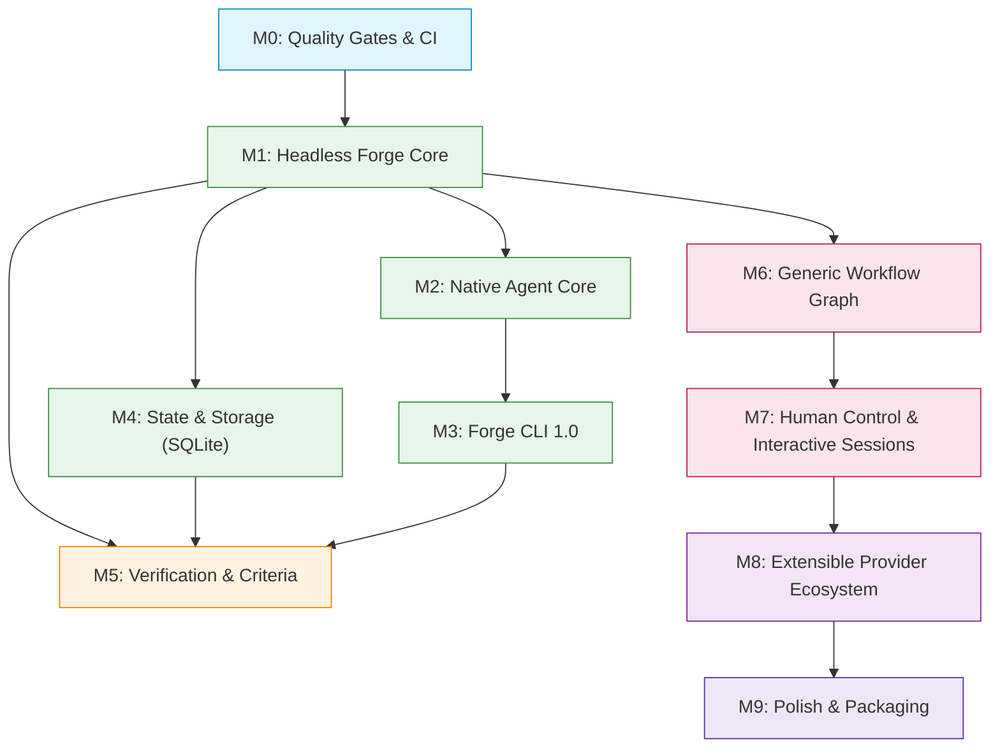

# Program Dependency Map

**Status:** PROPOSED  
**Authority:** Planning Truth  
**Last Updated:** 2026-09-21  
**Baseline:** `main` @ `5987501` (PR #204 merged)  
**Related Milestones:** [milestones.md](milestones.md)  

---

## 1. Topological Milestone Dependencies

---

## 2. Key Blocking Paths

1. **Headless Decoupling (M1) Was the Universal Blocker**:
   - Until `createForgeCore` was decoupled from Electron (PR #198), neither the standalone CLI (`bin/forge.ts`) nor automated headless CI testing could exist. M1 unblocked M2, M3, M4, and M6.
2. **Dual-Tier State (M4) Unblocks Advanced Verification (M5)**:
   - To store criteria test logs, raw compilation outputs, and unified diffs without memory pressure, `ArtifactService` and SQLite `RunStore` were required (PR #203). This unblocked `CRIT-001` and `ARTIFACT-001` (PR #204).
3. **Graph Engine (M6) Precedes Advanced Human Steering (M7)**:
   - Dynamic stage pause, resume, and branch-level steering require a graph execution kernel (`WORK-001`) to support arbitrary execution nodes rather than a fixed sequential pipeline.
